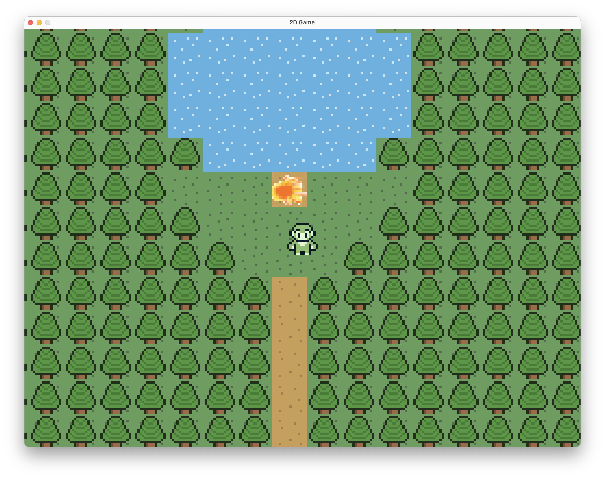

# Initia

Initia is a simple open-world 2D game created in **Java**.  
It serves as an introductory project to explore core concepts of game development such as rendering, tile-based maps, and player movement.

---

## Features
- Walkable **50x50 tile map**
- Keyboard-based **player movement**
- Multiple tile types: grass, walls, water, earth, trees, sand  
- Easy map customization via numeric tile values

---

## Requirements
- **Java 17+**
- Works with common IDEs (IntelliJ IDEA, VS Code, Eclipse)

---

## Installation & Usage
1. Clone the repository:
   ```bash
   git clone https://github.com/yourusername/initia.git
   cd initia

## Screenshot

